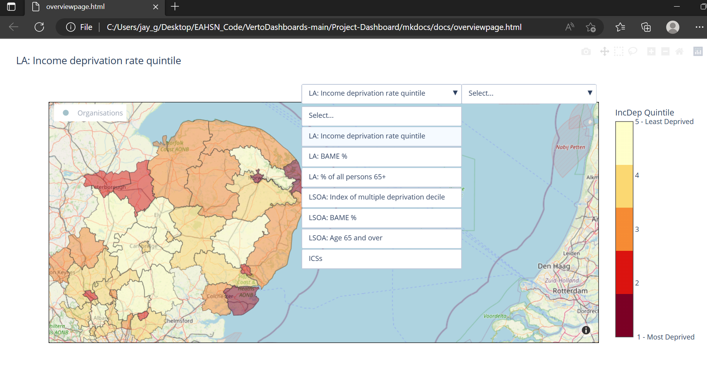

# VertoDashboards

- [VertoDashboards](#vertodashboards)
  - [Setup](#setup)
    - [Python dependencies](#python-dependencies)
    - [Get data files and generate site](#get-data-files-and-generate-site)
    - [Publishing the site](#publishing-the-site)
    - [Data Sources](#data-sources)
        - [Mapping/Shape Files](#mappingshape-files)
    - [Maintenance](#maintenance)
    - [Demo Screenshots](#demo-screenshots)

## Setup

### Python dependencies

```bash
cd VertoDashboards
python -m venv .venv
source .venv/*/activate
## windows
pip install pipwin
pipwin install gdal
pipwin install fiona
pip install dash pandas plotly fire geopandas geofeather pyyaml mkdocs mkdocs-material
```

### Get data files and generate site

**Note that data files have been removed/inaccessible due to company privacy**

Sync the [data file area][intern-sharepoint] to your device and generate the full markdown site.

```bash
cd VertoDashboards
cp -r ~/Eastern\ Academic\ Health\ Science\ Network/EAHSN\ Informatic\ Environment\ -\ 01_Dashboards/Internship_2022/data .
# fully qualified 
python Mapping.py generate --outdir mkdocs/docs --path_to_data data --path_to_config config_mkdocs.yml --path_to_site mkdocs 
# view locally
(cd mkdocs/site/ && python -m http.server)
# Access CLI help
python Mapping.py generate --help
```

The Mkdocs folder contains the files that enable generation and customization of site:

- Mkdocs.yml
    - Contains configuration for site navigation to each page and styling options
- Docs folder
    -  Index.md
        - Homepage of the website
    - Organisations.md, overall.md, project.md
        - Pages for each view including iframes to embed the html outputs of the mapping.py script
- Custom_theme folder
    - Contains images and css files for styling 

### Publishing the site

The contents of `mkdocs/site` is a full static website that can be hosted on a webserver.

### Data Sources

- Age
    - Local Authority: [population_data_age_gender_2019.csv][population-profiles-LA]
    - LSOA: [NOMIS_LC2101EW - by age - 2011 Census.csv][NOMIS_LC2101EW - by age - 2011 Census.csv]
- Ethnicity
    - Local Authority: [ethnicity_local_authority_2011.csv][population-profiles-LA]
    - LSOA: [Ethnicity_2011_lsoa.csv][Ethnicity_2011_lsoa.csv]
- Deprivation
    - Local Authority: [IMD_data_local _authorities_2019.csv][IMD_data_local _authorities_2019.csv] (converted from xlsx file)
    - LSOA: [IMD2019-ALL.csv][IMD2019-ALL.csv]
- Organisation list: Organisations.csv
    - Collected from the members tab in [Verto][Verto]
    - Locations were added manually by looking up organisational postcodes and [converting to latitude/longitude][postcode-conversion]
- Combined report: Combined_Report.csv
    - This file contains the project stage information for each organisation
    - How to generate:
        1. [Verto][Verto] -> Reports tab -> PMO Reports -> Implementation Report -> View -> Download 7 CSVs (All dropdowns should have 'select all' except Portfolio, where one portfolio is selected for each CSV download)
        2. Rename each file according to the Portfolio it contains e.g Local Delivery.csv
        3. Move the downloaded CSV files to /data/Portfolio_Reps
        4. Run CombiningReports.py to generate the new Combined_Report.csv file to /data
    - Currently, a monthly subscription can be setup to automatically email the CSV files every month to a specific email address, bypassing step 1.
    - There is an API for Verto that could enable automatic updates but this has not been setup yet.

##### Mapping/Shape Files

- Shape Files:
    - Geojson files were modified using [Mapshaper](https://mapshaper.org/) to fit Eastern AHSN boundaries
        - Local Authority: [local_authorities.geojson][local_authorities.geojson]
            - Local authorities were manually selected from the Eastern AHSN region using Mapshaper
            - File was then simplified using Visvalingam/effective area and Prevent Shape Removal switched on (all in mapshaper) to 21.41% of original
        - LSOA map: [lsoa_v2.geojson][lsoa_v2.geojson]
            - LSOA regions were manually selected from the Eastern AHSN region using Mapshaper
                - This was done by overlaying the local authority geojson on top of the lsoa map in Mapshaper and then selecting LSOA regions within the local authorities 
        - ICSs: [STPs.geojson][STPs.geojson]
            - Contains all ICSs/STPs in England
            - File was simplified using same settings as for local authority but simplification increased so the new file was 4.75% of the original
            - Mapping.py automatically filters for the Eastern AHSN regions based on region names in ics_locations.csv

Note that some local authorities have changed since the IMD and population data was collected
e.g. late 2019 saw the creation of West Northamptonshire, comprising the pre-2019 areas of Daventry, Northampton and South Northamptonshire; 
and North Northamptonshire, comprising the current areas of Corby, East Northamptonshire, Kettering and Wellingborough. 
Buckinghamshire County Council was made in 2020 including the districts of South Bucks, Chiltern, Wycombe and Aylesbury Vale.
This leaves some gaps in the map since the shape file is from 2021

### Maintenance

When projects occur at previously unseen organisations the latitude and longditude in the Organisations.csv file must be added manually, looking up the Organisation's post code and [converting this][postcode-conversion]

Minor stylistic edits can be changed in the config.yml file, including colour schemes and file names. Config_mkdocs.yml contains styles used by the mkdocs site (e.g. no heading or subheadings).

### Demo Screenshots

Information shown in screenshots limited again by company privacy.

Organisation View:


Prohect View:


Overall view:


<!-- refs -->
[intern-sharepoint]: https://eahsn.sharepoint.com/:f:/s/EAHSNInformaticDevelopmentEnvironment/EtvqvUzEtnlJsC3ErrG-QYcB1KuWHSPdxeX0cAhVsPT7mg?e=uVEacf
[population-profiles-LA]: https://www.ons.gov.uk/peoplepopulationandcommunity/populationandmigration/populationestimates/articles/populationprofilesforlocalauthoritiesinengland/2020-12-14
[IMD_data_local _authorities_2019.csv]: https://www.ons.gov.uk/peoplepopulationandcommunity/personalandhouseholdfinances/incomeandwealth/datasets/mappingincomedeprivationatalocalauthoritylevel
[NOMIS_LC2101EW - by age - 2011 Census.csv]: https://eahsn.sharepoint.com/:x:/r/sites/HealthInformatics/_layouts/15/Doc.aspx?sourcedoc=%7BD8A6D06C-4096-4F5A-B592-3A463F8EC2A2%7D&file=NOMIS_LC2101EW%20-%20by%20age%20-%202011%20Census.csv&action=default&mobileredirect=true
[Ethnicity_2011_lsoa.csv]: https://eahsn.sharepoint.com/:x:/r/sites/HealthInformatics/_layouts/15/Doc.aspx?sourcedoc=%7B878B73B3-449A-4945-9B03-60186411BDF1%7D&file=NOMIS_LC2101EW%20-%20by%20Ethnicity%20-%202011%20Census.csv&action=default&mobileredirect=true
[IMD2019-ALL.csv]: https://eahsn.sharepoint.com/:x:/r/sites/HealthInformatics/_layouts/15/Doc.aspx?sourcedoc=%7BAD81B33D-17F1-477A-BCC0-2B0BD0D8407E%7D&file=IMD2019-ALL.csv&action=default&mobileredirect=true
[Verto]: https://www.vertogrid.com/eahsn/forms/master.aspx?type=Tab&TopID=17&ItemID=0
[local_authorities.geojson]: https://hub.arcgis.com/datasets/ons::local-authority-districts-december-2021-uk-bfc/explore?location=52.188324%2C0.779716%2C8.28
[lsoa_v2.geojson]: https://hub.arcgis.com/datasets/communities::lower-super-output-area-lsoa-imd2019-wgs84/explore?location=52.256611%2C0.797007%2C9.15
[STPs.geojson]: https://hub.arcgis.com/datasets/ons::sustainability-and-transformation-partnerships-february-2017-generalised-clipped-boundaries-in-england/explore?location=52.108536%2C1.618177%2C7.68
[postcode-conversion]: https://www.freemaptools.com/convert-uk-postcode-to-lat-lng.htm
